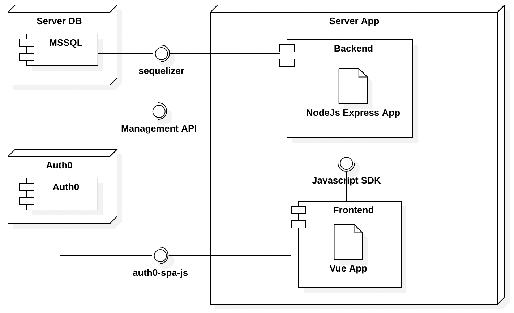

# Architettura

I diagrammi inseriti in seguito hanno lo scopo di spiegare quali sono le diverse parti che compongono T-Order e in che modo comunicano fra di loro

## Componenti

Il Seguente diagramma permette di visualizzare l'organizzazione dei diversi componenti e le vie di comunicazione

## Sequenza completa richiesta

Questo diagramma mostra la sequenza completa di una qualsiasi operazione eseguita nel frontend che richieda l'interazione con il database.

## Sequenza backend

Questo diagramma mostra quello che avviene all'interno del backend in seguito alla ricezione di una richiesta

