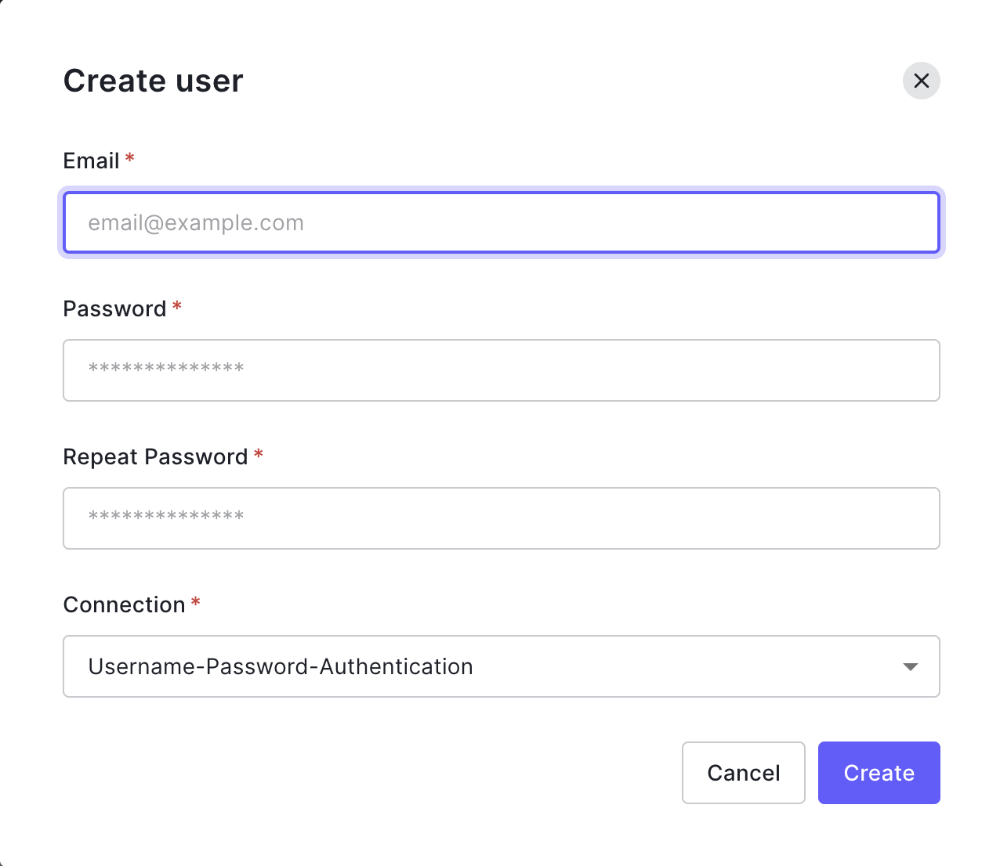
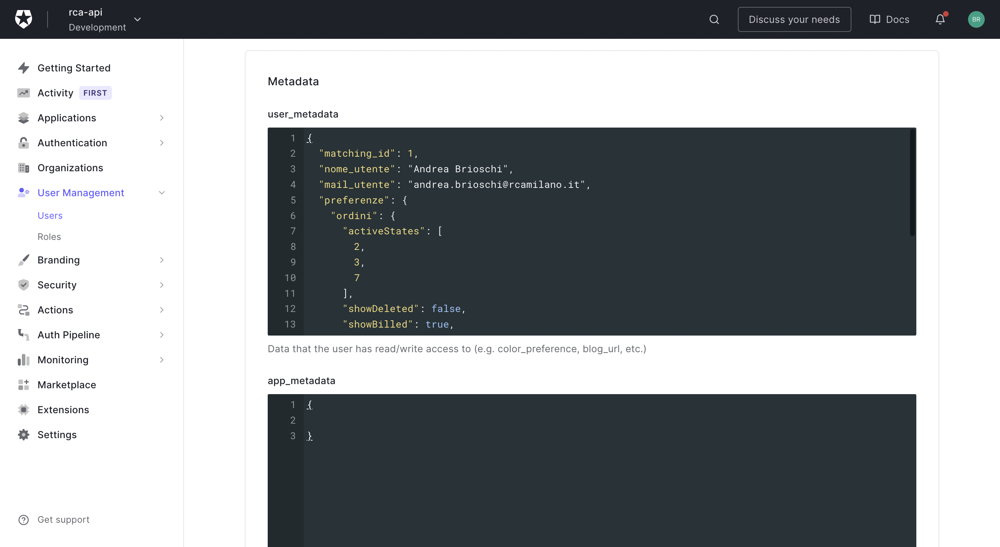

# Generazione utente

Ogni utente deve essere generato dal pannello di controllo di Auth0 e poi correttamente configurato, la procedura completa per l'inserimento di un nuovo utente è la seguente:

1. Creazione utente Auth0
2. Inserimento utente all'interno del database
3. Inserimento metadati utente in Auth0

### Creazione utente Auth0

Tramite il pannello di controllo di Auth0 nella sezione `User Management / User` cliccare sul pulsante `Create User`

Inserire e-mail e password, lasciare selezionato Username-Password-Authentication e fare click su `Create`.

### Inserimento utente all'interno del database

Ogni utente presente all'interno di Auth0 deve corrispondere ad uno specifico record della tabella utente del database.

L'id dell'utente del database viene salvato fra i metadati dell'utente di Auth0, in questo modo è possibile creare relazioni all'interno del database con uno specifico utente e ricollegarlo all'utente Auth0.

### Inserimento metadati utente in Auth0

Nel pannello di controllo di Auth0 è possibile assegnare dei metadati ad uno specifico utente, questi metadati tramite alcune regole specifiche definite nella sezione `Auth Pipeline / Rules` vengono inseriti all'interno del token per poi essere utilizzati dalle applicazioni per diversi scopi.

#### Esempio configurazione

    {
        //riferimento id tabella utente database
        matching_id: 1,
        nome_utente: Andrea Brioschi,
        mail_utente: andrea.brioschi@rcamilano.it,
        //utilizzato per personalizzare il frontend
        preferenze: {
            ordini: {
                //stati selezionati al primo caricamento lista ordini
                activeStates: [
                    2,
                    3,
                    7
                ],
                //mostra ordini cancellati
                showDeleted: false,
                //mostra ordini fatturati
                showBilled: true,
                toggleStatus: true,
                //ricerca ragione sociale
                ragsoc: ,
                //ricerca id ordine
                ordine: ,
                //ricerca id utente
                utente: 0,
                //ricerca id tecnico
                tecnico: 0,
                all_status: false
            }
        },
        //utilizzato in backend per invio mail
        riceve_mail: {
            errore_conferma_cliente: true
        }
    }
