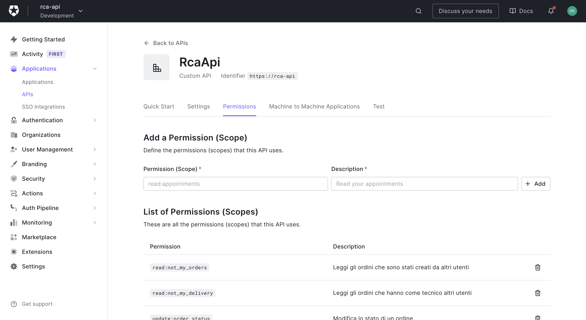
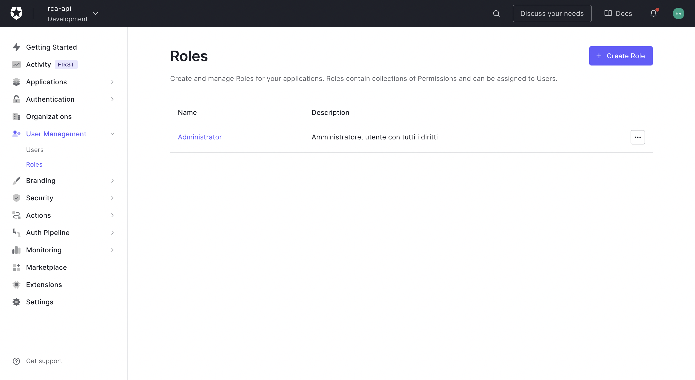
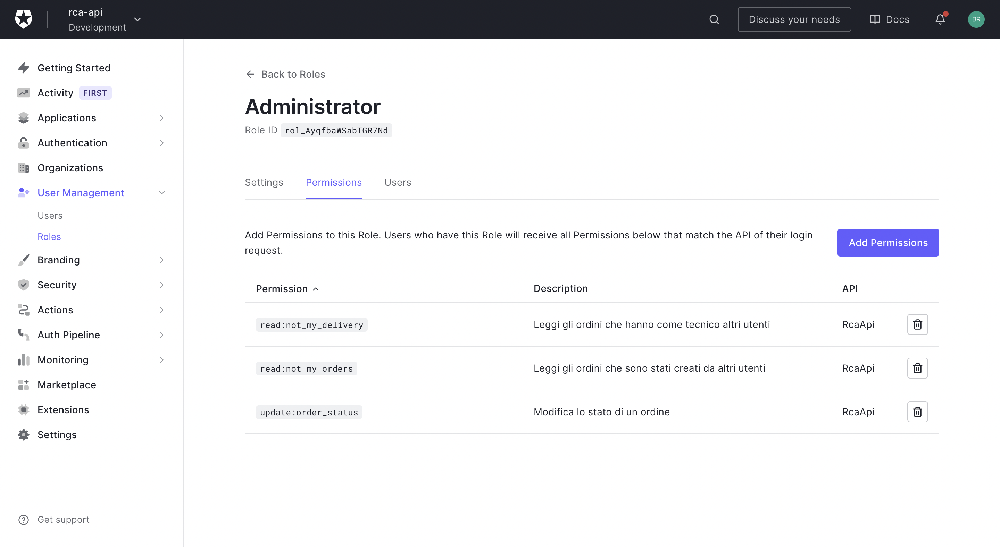
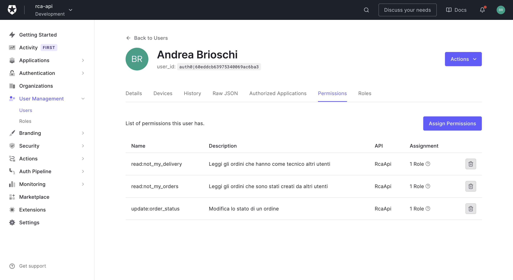
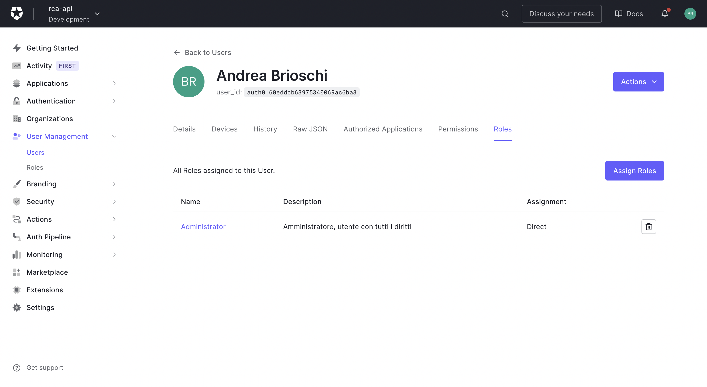

# Privilegi e Ruoli

I ruoli e privilegi in Auth0 sono specifici per ogni API e devono essere configurati dal pannello di controllo di Auth0.

I privilegi di un utente fanno parte delle informazioni contenute all'interno del Token, in questo modo sia frontend che backend sono consapevoli dei privilegi di ogni utente e possono adattarsi di conseguenza.

Ogni utente appena generato non ha alcun ruolo ne privilegio.

## Creazione

Prima di assegnarli ad un utente è necessario creare i ruoli e i privilegi.

### Creazione Privilegi

Per creare un nuovo privilegio è necessario recarsi nella sezione `Applications / APIs`, selezionare `RcaApi` e poi cliccare sul tab `Permissions`, aggiungere il nome e la descrizione del permesso e poi premere `Add`

### Creazione Ruoli

Per creare un nuovo ruolo è necessario recarsi nella sezione `User Management / Roles` e fare click su `Create Role`, inserire nome e descrizione e cliccare su create.

In questo modo verrà creato un nuovo ruolo senza alcun privilegio, per assegnare i privilegi al ruolo cliccare sul nome del ruolo appena creato e poi sul tab `Permissions`, facendo click sul pulsante `Add Permissions` e selezionando RcaApi sarà possibile aggiungere un privilegio al ruolo.

## Assegnamento

Dopo aver definito i ruoi e i privilegi per l'API è possibile assegnarli agli utenti

### Assegnamento Privilegi

Per assegnare dei privilegi ad un utente è necessario recarsi nella sezione `User Management / User / $UTENTE` e cliccare sul tab `Permissions`.

Dopo di che fare click su `Assign Permission` e selezionare le Api RcaApi selezionare uno specifico permesso e cliccare `Add Permission`

Per configurare i privilegi in gruppo è possibile utilizzare i Ruoli.

### Assegnamento Ruoli

Un ruolo permette di gestire molteplici privilegi in contemporanea, e possibile infatti definire un ruolo selezionando i privilegi di quello specifico ruolo per poi assegnarlo all'utente assegnandogli in questo modo tutti i permessi di quel ruolo contemporaneamente.

Un utente può avere più ruoli.

Per assegnare un ruolo ad un utente è necessario recarsi nella sezione `User Management / User / $UTENTE` e cliccare sul tab `Permissions`.

Dopo di che fare click su `Assign Roles` e selezionare il ruolo desiderato e cliccare `Add Permission`

