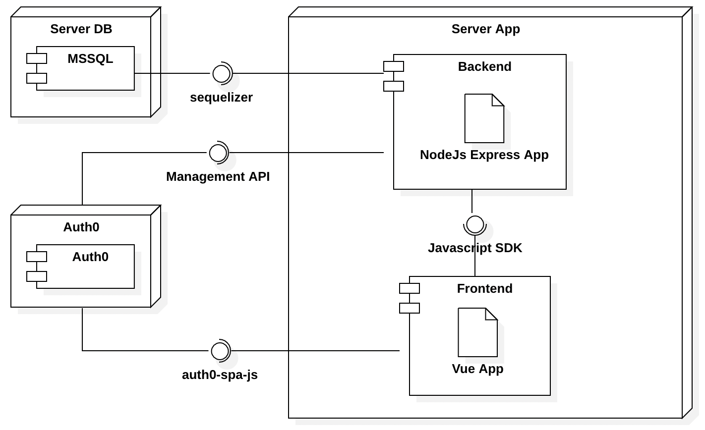
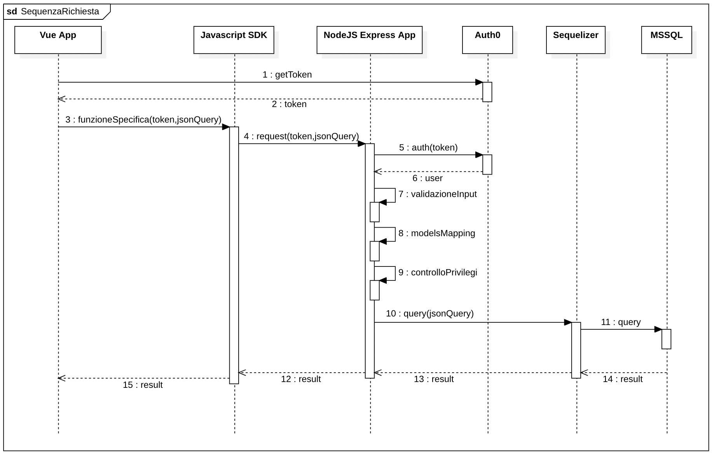

# Introduzione

T-Order è suddiviso in diversi componenti che collaborano per gestire diverse funzionalita e offrire il servizio agli utenti in diverse modalità.

I diagrammi inseriti in seguito hanno lo scopo di spiegare quali sono le diverse parti che compongono T-Order e in che modo comunicano fra di loro

## Componenti

Il Seguente diagramma permette di visualizzare l'organizzazione dei diversi componenti e le vie di comunicazione

### Server DB e MSSQL

Il server sul quale risiede il database è un server proprietario della ditta RCA SRL con le seguenti specifiche

- **Sistema Operativo**: ???
- **Processore**: ???
- **RAM**: ???

Il DBMS utilizzato per la gestione dei dati è Microsoft SQL Server.

[Approfondisci il Database](database){.md-button .md-button--primary}

### Server app

Il server sul quale risiede l'applicazione è un server proprietario della ditta RCA SRL con le seguenti specifiche

- **Sistema Operativo**: Windows Server 2012 R2 Datacenter
- **Processore**: Intel Xenon ES-2650L v4 1.70GHz
- **RAM**: 8GB

L'applicazione è suddivisa in backend e frontend.

!!! tip "Separazione"

    Attualmente l'applicazione di frontend viene servita direttamente dall'applicazione di backend, nonostante ciò è possibile eseguire l'applicazione di frontend compilata anche al di fuori del server.

    Questa decisione è stata presa per poter lanciare l'applicazione in un singolo processo e con un singolo comando.

#### Backend

L'applicazione di backend è un server Node.Js con framework express.

Il backend è l'unico componente in comunicazione diretta con il database e si occupa di gestire tutte le interazioni con quest'ultimo.

##### Sequelize

La comunicazione fra backend e database e gestita dal modulo sequelize che è in grado di connettersi ad un database, mantenere aperta una connessione e comporre automaticamente le query da inviare al basandosi su dei modelli.

[Approfondisci il Backend](backend){.md-button .md-button--primary}

#### Frontend

[Approfondisci il Frontend](frontend){.md-button .md-button--primary}

## Sequenza completa richiesta

Questo diagramma mostra la sequenza completa di una qualsiasi operazione eseguita nel frontend che richieda l'interazione con il database.

## Sequenza backend

Questo diagramma mostra quello che avviene all'interno del backend in seguito alla ricezione di una richiesta

