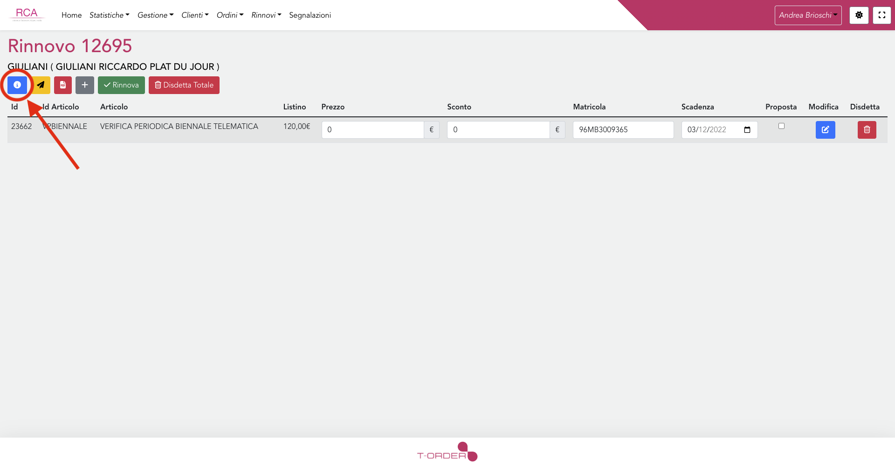
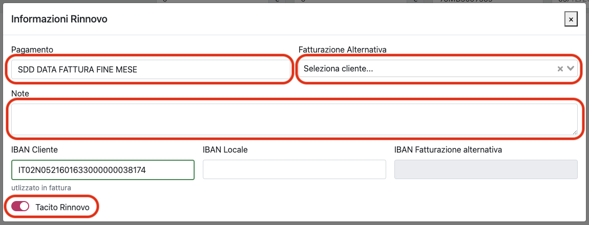

# Configurazione rinnovo locale

Tutti i rinnovi di un certo locale condividono alcune informazioni: pagamento, fatturazione alternativa, note e tacito rinnovo.

Ogni volta che viene generato un rinnovo per un locale che non è mai stato inserito all'interno dei rinnovi bisogna selezionare il metodo di pagamento e (se necessario) gli altri dati condivisi che saranno poi disponibili in tutti i rinnovi futuri dello stesso locale.

## Come modificare la configurazione di un locale

Per modificare la configurazione di un locale è necessario, dalla lista dei rinnovi annuali, selezionare un rinnovo del locale che intendiamo modificare, dopo di che:

1. Fare click sul pulsante con l'icona 'i'
   

2. Si aprità un modale all'interno del quale è possibile inserire diverse informazioni relative al rinnovo, fra queste informazioni il metodo di pagamento, la fatturazione alternativa le note e l'informazione tacito rinnovo sono quelle che fanno parte della configurazione per i rinnovi del locale e perciò saranno uguali per ogni rinnovo dello stesso locale
   

## Note tecniche

Questi dati vengono salvati all'interno della tabella configurazione_rinnovo_locale che prevede un record per ogni locale per il quale sono stati inseriti almeno uno dei campi scritti sopra.
