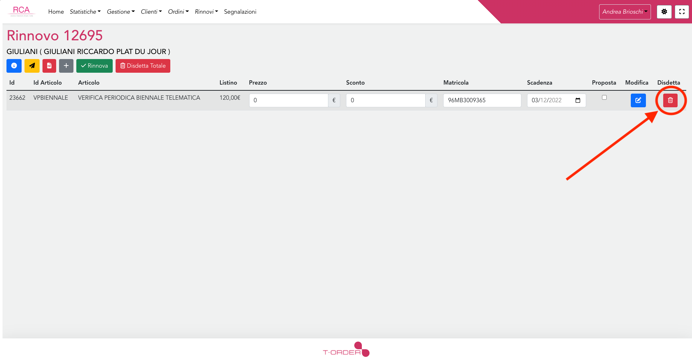
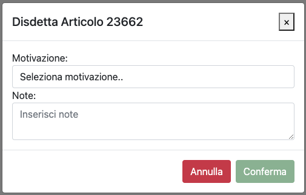
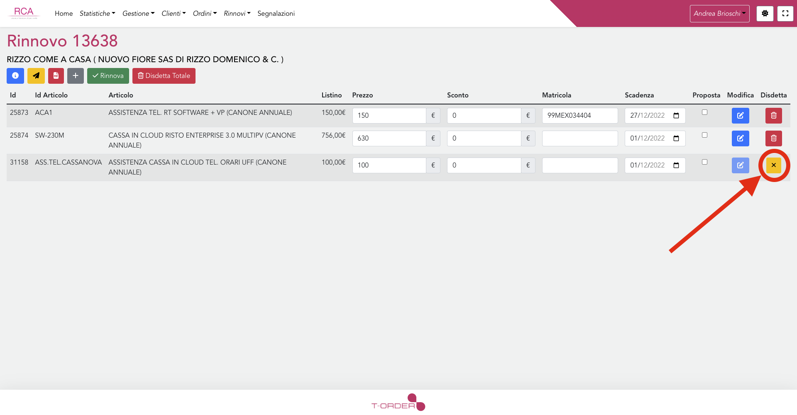

# Disdetta

E' possibile eliminare un articolo da un rinnovo effettuando la disdetta.

La disdetta dell'articolo di un rinnovo comporta:

1.  Eliminazione dell'articolo dal rinnovo
2.  Se non sono presenti altri articoli all'interno del rinnovo, chiusura del rinnovo
    1. (Note tecniche) Impostazione completato = 1 nel rinnovo
3.  Se l'articolo è stato importato tramite la procedura classica di [generazione rinnovo](../generazione), eliminazione dell'articolo dalla scheda cliente di trace
    1. (Note tecniche) Se trace_id != null
       ```
        {
          "deleted": 1,
          "date_import_trace": null
        }
       ```
4.  Salvataggio dello storico della disdetta

    ```
    (Note tecniche)
        {
          articolo,
          prezzo,
          matricola,
          data_scadenza,
          data_cancellazione: now(),
          cliente,
          locale,
          motivazione,
          utente: utente_richiesta,
          note
        }
    ```

## Disdetta totale

E' disponibile una specifica funzionalità per effettuare la disdetta di tutti gli articoli presenti all'interno di un rinnovo che non fa altro che applicare la logica di [disdetta](#disdetta) dei singoli articoli per ogni articolo presente all'interno del rinnovo.

## Come effettuare la disdetta

Per effettuare la disdetta di un articolo di un rinnovo è necessario, dalla lista dei rinnovi annuali, selezionare il rinnovo contenente l'articolo da disdire, dopo di che:

1. Fare click sul pulsante con l'icona del cestino
   

2. Selezionare una motivazione e inserire delle note (opzionali), dopo di che fare click su conferma  
   

### Eliminazione diretta

Se l'articolo che si desidera disdire è stato inserito direttamente all'interno del rinnovo e non è ancora stato confermato può essere eliminato direttamente senza dover inserire una motivazione, gli articoli di questo tipo sono riconoscibili nel frontend poichè anzi che l'icona rossa del cestino presentano un'icona gialla con una 'X'.


